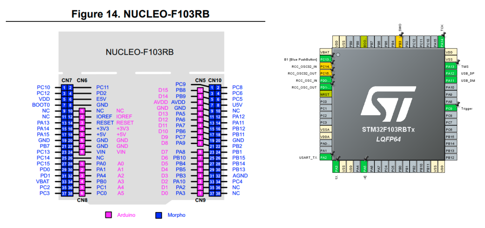

<!-- docs/_intro.md -->
# Presentation of the driver

## About the driver

- This driver is aimed at developers who want to be able to control the I/O of the STM32F103xx board easily.

## Features of this driver

- The driver allows the user to control the I/O with simple commands.

